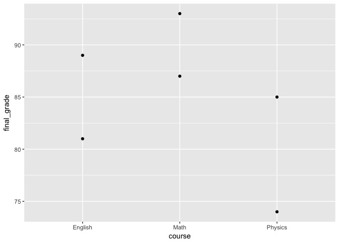
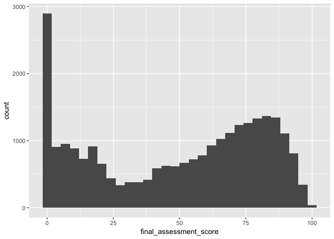
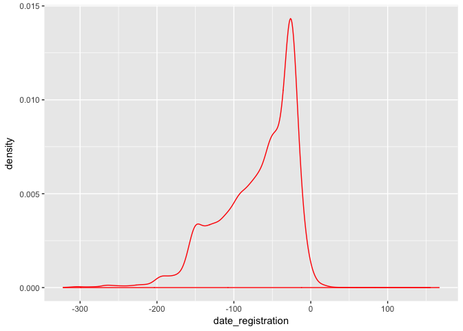
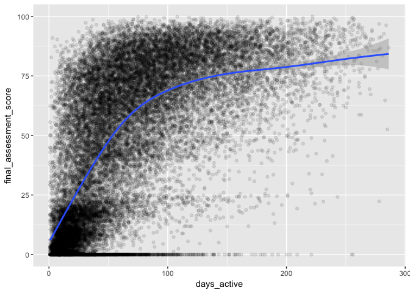
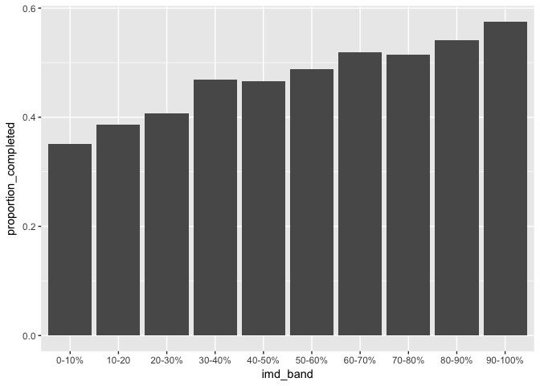
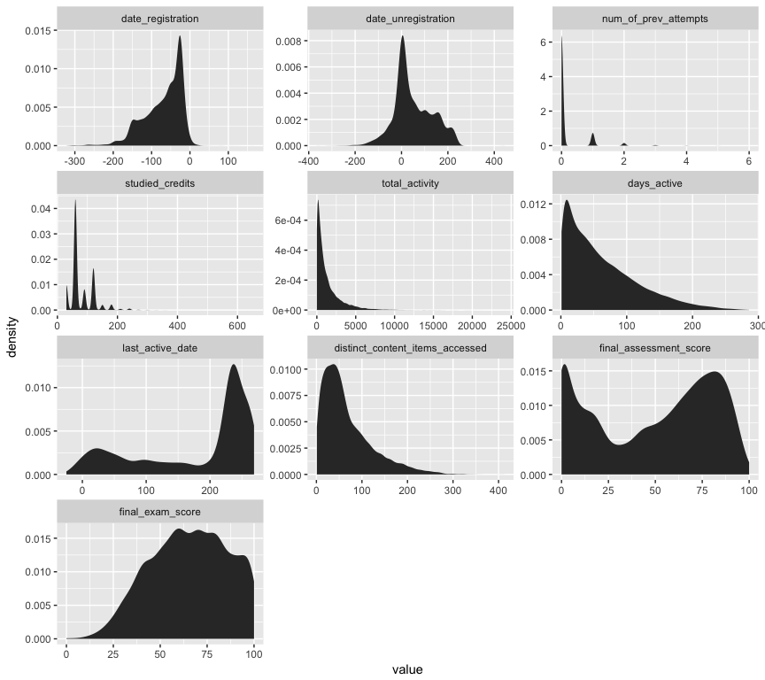
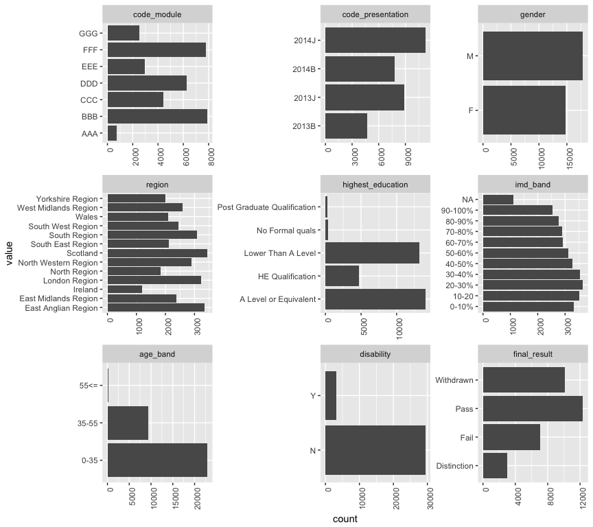

Data Wrangling in R - Learning Analytics Hackathon Workshop
================

How to get set up for this workshop
-----------------------------------

### Getting this document on your computer:

1.  Go to the GitHub repository here: <https://github.com/ubc/LA-OD-Hackathon-3.0>
2.  Click the green button on the right that says "Clone or download".
3.  Click "Download ZIP". (If you're proficient with git, feel free to clone the repository.)
4.  Create a folder on your computer to store your Hackathon work, and store your ZIP file there.
5.  Double-click your ZIP file to unzip it and get all the Hackathon code.

### Getting the data:

1.  Go to the Google Drive folder here: <https://drive.google.com/drive/folders/1g_ejTWCXFdGL5fmel4TNX57mDAX73l1P>.
2.  Right-click `all_enrolments.csv`, then click "Download".
3.  Move "all\_enrolments.csv" into your hackathon folder, and store it under `YOUR_FOLDER/LA-OD-Hackathon-3.0-master/R/`.

### Getting R and Rstudio

1.  Download and install R from here: <http://cran.stat.sfu.ca/>.
2.  Download and install RStudio Desktop (Open Source Edition) from here: <https://www.rstudio.com/products/rstudio/#Desktop>.

### Getting ready to play!

1.  In RStudio, open `data_wrangling_workshop.Rmd`, a file in `YOUR_FOLDER/LA-OD-Hackathon-3.0-master/R/`. (That's this file!)
2.  In the code snippet below, remove the hashtags from both lines, and click the green "play" button on the right to install two R packages you'll need for the workshop.

``` r
#install.packages("tidyverse")
#install.packages("reshape2")
```

If you're stuck installing the tidyverse, just install `dplyr`, with the line below:

``` r
#install.packages("dplyr")
```

Ready to rock!!!
----------------

First we'll load our packages:

``` r
library(tidyverse)
library(reshape2)
```

Then we'll load our data (don't worry if the code below is gibberish to you):

``` r
df <- read_csv("all_enrolments.csv") %>% 
  mutate(id_student = as.character(id_student),
         highest_education = factor(highest_education, 
                                    levels = c("No Formal quals",
                                               "Lower Than A Level",
                                               "A Level or Equivalent",
                                               "HE Qualification",
                                               "Post Graduate Qualification")),
         final_exam_score = as.numeric(final_exam_score))
```

A first look at our data.

``` r
df
```

    ## # A tibble: 32,593 x 20
    ##    code_module code_presentation id_student date_registration
    ##          <chr>             <chr>      <chr>             <dbl>
    ##  1         AAA             2013J      11391              -159
    ##  2         AAA             2013J      28400               -53
    ##  3         AAA             2013J      30268               -92
    ##  4         AAA             2013J      31604               -52
    ##  5         AAA             2013J      32885              -176
    ##  6         AAA             2013J      38053              -110
    ##  7         AAA             2013J      45462               -67
    ##  8         AAA             2013J      45642               -29
    ##  9         AAA             2013J      52130               -33
    ## 10         AAA             2013J      53025              -179
    ## # ... with 32,583 more rows, and 16 more variables:
    ## #   date_unregistration <dbl>, gender <chr>, region <chr>,
    ## #   highest_education <fctr>, imd_band <chr>, age_band <chr>,
    ## #   num_of_prev_attempts <int>, studied_credits <int>, disability <chr>,
    ## #   final_result <chr>, total_activity <dbl>, days_active <dbl>,
    ## #   last_active_date <dbl>, distinct_content_items_accessed <dbl>,
    ## #   final_assessment_score <dbl>, final_exam_score <dbl>

``` r
variable1 <- 1
1 + variable1
```

    ## [1] 2

``` r
?sum
?filter
```

    ## Help on topic 'filter' was found in the following packages:
    ## 
    ##   Package               Library
    ##   dplyr                 /Library/Frameworks/R.framework/Versions/3.4/Resources/library
    ##   stats                 /Library/Frameworks/R.framework/Versions/3.4/Resources/library
    ## 
    ## 
    ## Using the first match ...

Let's answer a question!

Is a registrant's likelihood of completing a course related to the standard of living in the place where they live?

There are two columns in our dataset that can help us answer this question:

-   `imd_band`: the Index of Multiple Depravation band of the place where the student lived during the module-presentation. A higher band means the place had a higher standard of living.
-   `final_result`: student’s final result in the module-presentation (i.e. the course).

Let's grab them!

Subsetting columns with `select()`
----------------------------------


`select()` takes a list of column names, and returns your dataframe but with only those columns. Let's create a small dataframe and see `select()` in action.

``` r
example_dataframe <- data.frame(
  course      = c("Physics", "Physics", "English", "English", "Math",  "Math"),
  student     = c("Alice",   "Bob",     "Alice",   "Bob",     "Alice", "Bob"),
  final_grade = c(85,        74,        81,        89,        93,      87),
  exam_grade  = c(87,        71,        80,        90,        95,      83)
)

# Let's take a look.
example_dataframe
```

    ##    course student final_grade exam_grade
    ## 1 Physics   Alice          85         87
    ## 2 Physics     Bob          74         71
    ## 3 English   Alice          81         80
    ## 4 English     Bob          89         90
    ## 5    Math   Alice          93         95
    ## 6    Math     Bob          87         83

``` r
# Now let's select just the `course` column.
select(.data = example_dataframe, course)
```

    ##    course
    ## 1 Physics
    ## 2 Physics
    ## 3 English
    ## 4 English
    ## 5    Math
    ## 6    Math

``` r
example_dataframe %>% 
  select(course)
```

    ##    course
    ## 1 Physics
    ## 2 Physics
    ## 3 English
    ## 4 English
    ## 5    Math
    ## 6    Math

``` r
# Now let's select the `student` column and the `final_grade` column.
example_dataframe %>% 
  select(student, final_grade)
```

    ##   student final_grade
    ## 1   Alice          85
    ## 2     Bob          74
    ## 3   Alice          81
    ## 4     Bob          89
    ## 5   Alice          93
    ## 6     Bob          87

### Practice time with `select()`!

Challenge: using our full dataframe, select just the `id_student` column.

``` r
df %>% 
  select(id_student)
```

    ## # A tibble: 32,593 x 1
    ##    id_student
    ##         <chr>
    ##  1      11391
    ##  2      28400
    ##  3      30268
    ##  4      31604
    ##  5      32885
    ##  6      38053
    ##  7      45462
    ##  8      45642
    ##  9      52130
    ## 10      53025
    ## # ... with 32,583 more rows

``` r
variable1 <- data.frame(thiscolumn = c(1,2,3), thisothercolumn = c(2,4,5))
vriable2 <- c(3,4,5)

class(vriable2)
```

    ## [1] "numeric"

Awesome. Now let's grab our two variables of interest, plus the `id_student` column, and save it in a new dataframe. (This step isn't strictly necessary, but it will make it easier for us to keep an eye on the columns we care about.)

``` r
df_selected <- df %>% 
  select(id_student, imd_band, final_result)

df_selected
```

    ## # A tibble: 32,593 x 3
    ##    id_student imd_band final_result
    ##         <chr>    <chr>        <chr>
    ##  1      11391  90-100%         Pass
    ##  2      28400   20-30%         Pass
    ##  3      30268   30-40%    Withdrawn
    ##  4      31604   50-60%         Pass
    ##  5      32885   50-60%         Pass
    ##  6      38053   80-90%         Pass
    ##  7      45462   30-40%         Pass
    ##  8      45642  90-100%         Pass
    ##  9      52130   70-80%         Pass
    ## 10      53025     <NA>         Pass
    ## # ... with 32,583 more rows

Creating new columns with `mutate()`
------------------------------------


Our next task is to create a column that tells us whether a registrant completed a course.

Unfortunately, we don't have a column that tells us this information directly. Instead, we have the `final_result` column, which has four values:

-   `"Distinction"`
-   `"Pass"`
-   `"Withdrawn"`
-   `"Fail"`

If we want to get just whether they completed the course, we'll need to aggregate `"Distinction"` and `"Pass"` into a single value, and `"Withdrawn"` and `"Fail"` into another.

To do this, we need to write code that does two things:

1.  Creates a new column.
2.  Fills that column with values we care about.

This is one of the most common tasks in data wrangling. In R, the easiest way to do it is to use the `mutate()` function.

``` r
example_dataframe
```

    ##    course student final_grade exam_grade
    ## 1 Physics   Alice          85         87
    ## 2 Physics     Bob          74         71
    ## 3 English   Alice          81         80
    ## 4 English     Bob          89         90
    ## 5    Math   Alice          93         95
    ## 6    Math     Bob          87         83

``` r
# We can fill our new column with whatever we like!
example_dataframe %>% 
  mutate(new_column = "hello!")
```

    ##    course student final_grade exam_grade new_column
    ## 1 Physics   Alice          85         87     hello!
    ## 2 Physics     Bob          74         71     hello!
    ## 3 English   Alice          81         80     hello!
    ## 4 English     Bob          89         90     hello!
    ## 5    Math   Alice          93         95     hello!
    ## 6    Math     Bob          87         83     hello!

``` r
example_dataframe %>% 
  mutate(new_column = 1)
```

    ##    course student final_grade exam_grade new_column
    ## 1 Physics   Alice          85         87          1
    ## 2 Physics     Bob          74         71          1
    ## 3 English   Alice          81         80          1
    ## 4 English     Bob          89         90          1
    ## 5    Math   Alice          93         95          1
    ## 6    Math     Bob          87         83          1

We can even use the other columns to determine the contents of the new one! Let's compute the students' grades on the non-exam portion of the course, assuming the exam was worth 50% of the final grade.

``` r
# (This is where the magic happens!)
example_dataframe %>% 
  mutate(non_exam_grade = (final_grade - 0.5*exam_grade) / 0.5) 
```

    ##    course student final_grade exam_grade non_exam_grade
    ## 1 Physics   Alice          85         87             83
    ## 2 Physics     Bob          74         71             77
    ## 3 English   Alice          81         80             82
    ## 4 English     Bob          89         90             88
    ## 5    Math   Alice          93         95             91
    ## 6    Math     Bob          87         83             91

### Practice time with `mutate()`!

Challenge: using `mutate()` and the `total_activity` and `days_active` columns, create a new column in our real dataset called `average_events_per_active_day`. (`total_activity` tells you the total number of events that were logged for that student.)

``` r
df %>% 
  mutate(
    average_events_per_active_day = total_activity/days_active
  ) %>% 
  select(id_student, total_activity, days_active, average_events_per_active_day)
```

    ## # A tibble: 32,593 x 4
    ##    id_student total_activity days_active average_events_per_active_day
    ##         <chr>          <dbl>       <dbl>                         <dbl>
    ##  1      11391            934          40                      23.35000
    ##  2      28400           1435          80                      17.93750
    ##  3      30268            281          12                      23.41667
    ##  4      31604           2158         123                      17.54472
    ##  5      32885           1034          70                      14.77143
    ##  6      38053           2445         143                      17.09790
    ##  7      45462           1492          90                      16.57778
    ##  8      45642           1428         105                      13.60000
    ##  9      52130           1894         122                      15.52459
    ## 10      53025           3158         142                      22.23944
    ## # ... with 32,583 more rows

Now. What we actually need to do to answer our question is create a column that tells us whether the student passed their course. A good way to handle this is to use the `case_when()` function.

`case_when()` takes a series of two-side formulas. The left-hand side of each formula is a condition, and the right-hand side is the desired output. For example:

``` r
cool_values <- c(TRUE, FALSE, FALSE)

cool_values
```

    ## [1]  TRUE FALSE FALSE

``` r
case_when(
  cool_values == TRUE ~ "hey there!",
  cool_values == FALSE ~ "what's up?"
)
```

    ## [1] "hey there!" "what's up?" "what's up?"

``` r
cool_numbers <- c(1,2,3,4,5,6,7,8,9,10)

cool_numbers
```

    ##  [1]  1  2  3  4  5  6  7  8  9 10

``` r
case_when(
  cool_numbers < 5 ~ "small",
  cool_numbers > 5 ~ "BIG!!!!",
  TRUE ~ "default_value"
)
```

    ##  [1] "small"         "small"         "small"         "small"        
    ##  [5] "default_value" "BIG!!!!"       "BIG!!!!"       "BIG!!!!"      
    ##  [9] "BIG!!!!"       "BIG!!!!"

All we need to do now is use `case_when()` within `mutate()` to create a new column that tells us whether the student in each row completed their course:

``` r
# Let's save the result in a new dataframe called `df_mutated`.
df_mutated <- df_selected %>% 
  mutate(
    completed_course = case_when(
      final_result == "Pass" ~ TRUE,
      final_result == "Distinction" ~ TRUE,
      final_result == "Fail" ~ FALSE,
      final_result == "Withdrawn" ~ FALSE
    )
  )

# Let's take a look!
df_mutated
```

    ## # A tibble: 32,593 x 4
    ##    id_student imd_band final_result completed_course
    ##         <chr>    <chr>        <chr>            <lgl>
    ##  1      11391  90-100%         Pass             TRUE
    ##  2      28400   20-30%         Pass             TRUE
    ##  3      30268   30-40%    Withdrawn            FALSE
    ##  4      31604   50-60%         Pass             TRUE
    ##  5      32885   50-60%         Pass             TRUE
    ##  6      38053   80-90%         Pass             TRUE
    ##  7      45462   30-40%         Pass             TRUE
    ##  8      45642  90-100%         Pass             TRUE
    ##  9      52130   70-80%         Pass             TRUE
    ## 10      53025     <NA>         Pass             TRUE
    ## # ... with 32,583 more rows

We're well on our way. But there is another monster to defeat: there are missing values in both `imd_band` and `completed_course`! What to do?

Subsetting rows with `filter()`
-------------------------------


Technically, there are fancy statistical things you can do to deal with missing values. But today, we're just going to remove the rows where they occur in either of our two columns of interest.

The easiest way to do this in R is to use the `filter()` function, which keeps only the rows in a dataframe that match a condition you pass in. For example:

``` r
example_dataframe
```

    ##    course student final_grade exam_grade
    ## 1 Physics   Alice          85         87
    ## 2 Physics     Bob          74         71
    ## 3 English   Alice          81         80
    ## 4 English     Bob          89         90
    ## 5    Math   Alice          93         95
    ## 6    Math     Bob          87         83

``` r
# Use `==` for "equals"
example_dataframe %>% 
  filter(course == "English")
```

    ##    course student final_grade exam_grade
    ## 1 English   Alice          81         80
    ## 2 English     Bob          89         90

``` r
# Use `|` for "or".
example_dataframe %>% 
  filter(course == "English" | course == "Physics")
```

    ##    course student final_grade exam_grade
    ## 1 Physics   Alice          85         87
    ## 2 Physics     Bob          74         71
    ## 3 English   Alice          81         80
    ## 4 English     Bob          89         90

``` r
# In `filter()`, each comma-separation is treated as "and". But you could also use `&`.
example_dataframe %>% 
  filter(course == "English" | course == "Physics",
         student == "Alice")
```

    ##    course student final_grade exam_grade
    ## 1 Physics   Alice          85         87
    ## 2 English   Alice          81         80

``` r
# Use `!` for negation. This turns `TRUE` into `FALSE` and `FALSE into `TRUE`.
example_dataframe %>% 
  filter(final_grade != 83,
         exam_grade < 90) # Greater than is `>`, lesser than is `<`.
```

    ##    course student final_grade exam_grade
    ## 1 Physics   Alice          85         87
    ## 2 Physics     Bob          74         71
    ## 3 English   Alice          81         80
    ## 4    Math     Bob          87         83

### Practice time with `filter()`!

Challenge: keep only the subset of rows in our dataframe where the code module was `AAA` and the student had more than 0 previous attempts.

``` r
df
```

    ## # A tibble: 32,593 x 20
    ##    code_module code_presentation id_student date_registration
    ##          <chr>             <chr>      <chr>             <dbl>
    ##  1         AAA             2013J      11391              -159
    ##  2         AAA             2013J      28400               -53
    ##  3         AAA             2013J      30268               -92
    ##  4         AAA             2013J      31604               -52
    ##  5         AAA             2013J      32885              -176
    ##  6         AAA             2013J      38053              -110
    ##  7         AAA             2013J      45462               -67
    ##  8         AAA             2013J      45642               -29
    ##  9         AAA             2013J      52130               -33
    ## 10         AAA             2013J      53025              -179
    ## # ... with 32,583 more rows, and 16 more variables:
    ## #   date_unregistration <dbl>, gender <chr>, region <chr>,
    ## #   highest_education <fctr>, imd_band <chr>, age_band <chr>,
    ## #   num_of_prev_attempts <int>, studied_credits <int>, disability <chr>,
    ## #   final_result <chr>, total_activity <dbl>, days_active <dbl>,
    ## #   last_active_date <dbl>, distinct_content_items_accessed <dbl>,
    ## #   final_assessment_score <dbl>, final_exam_score <dbl>

``` r
df %>% 
  filter(
    num_of_prev_attempts > 0 & code_module == "AAA"
  )
```

    ## # A tibble: 41 x 20
    ##    code_module code_presentation id_student date_registration
    ##          <chr>             <chr>      <chr>             <dbl>
    ##  1         AAA             2014J      65002              -144
    ##  2         AAA             2014J      94961              -150
    ##  3         AAA             2014J     121349               -28
    ##  4         AAA             2014J     129955              -143
    ##  5         AAA             2014J     135335               -82
    ##  6         AAA             2014J     135400               -51
    ##  7         AAA             2014J     141377              -127
    ##  8         AAA             2014J     147756               -41
    ##  9         AAA             2014J     148993              -154
    ## 10         AAA             2014J     155984              -156
    ## # ... with 31 more rows, and 16 more variables: date_unregistration <dbl>,
    ## #   gender <chr>, region <chr>, highest_education <fctr>, imd_band <chr>,
    ## #   age_band <chr>, num_of_prev_attempts <int>, studied_credits <int>,
    ## #   disability <chr>, final_result <chr>, total_activity <dbl>,
    ## #   days_active <dbl>, last_active_date <dbl>,
    ## #   distinct_content_items_accessed <dbl>, final_assessment_score <dbl>,
    ## #   final_exam_score <dbl>

To get at the missing values in our two columns of interest, you may be tempted to write conditions like `imd_band == NA` or `completed_course == NA`. However, in R, the best practice for checking whether a value is missing is to use the function `is.na()`.

In the code snippet below, I keep only the subset of rows where neither `imd_band` or `completed_course` is missing.

``` r
# Let's save the result in a new dataframe called `df_filtered`.
df_filtered <- df_mutated %>% 
  filter(!is.na(imd_band),
         !is.na(completed_course))

df_filtered
```

    ## # A tibble: 31,482 x 4
    ##    id_student imd_band final_result completed_course
    ##         <chr>    <chr>        <chr>            <lgl>
    ##  1      11391  90-100%         Pass             TRUE
    ##  2      28400   20-30%         Pass             TRUE
    ##  3      30268   30-40%    Withdrawn            FALSE
    ##  4      31604   50-60%         Pass             TRUE
    ##  5      32885   50-60%         Pass             TRUE
    ##  6      38053   80-90%         Pass             TRUE
    ##  7      45462   30-40%         Pass             TRUE
    ##  8      45642  90-100%         Pass             TRUE
    ##  9      52130   70-80%         Pass             TRUE
    ## 10      57506   70-80%         Pass             TRUE
    ## # ... with 31,472 more rows

Computing summaries of subgroups with `group_by()` & `summarise()`
------------------------------------------------------------------


Now we need to count how many people completed their courses across different values of `imd_band`.

To do this, we can use two functions: `group_by()` and `summarise()`.

`group_by()` specifies which variable(s) you want to use to compute summaries within, and `summarise()` squishes the dataframe down to just one row per group, creating a column with whatever summary value you specify. Here's an example:

``` r
# Let's just remind ourselves of what our original example dataframe looks:
example_dataframe
```

    ##    course student final_grade exam_grade
    ## 1 Physics   Alice          85         87
    ## 2 Physics     Bob          74         71
    ## 3 English   Alice          81         80
    ## 4 English     Bob          89         90
    ## 5    Math   Alice          93         95
    ## 6    Math     Bob          87         83

``` r
# We can group by course and compute the mean final_grade.
example_dataframe %>% 
  group_by(course) %>% 
  summarise(mean_grade = mean(final_grade))
```

    ## # A tibble: 3 x 2
    ##    course mean_grade
    ##    <fctr>      <dbl>
    ## 1 English       85.0
    ## 2    Math       90.0
    ## 3 Physics       79.5

``` r
# Or we can group by students and compute the mean grade.
example_dataframe %>% 
  group_by(student) %>% 
  summarise(mean_grade = mean(final_grade))
```

    ## # A tibble: 2 x 2
    ##   student mean_grade
    ##    <fctr>      <dbl>
    ## 1   Alice   86.33333
    ## 2     Bob   83.33333

``` r
# Of course, we're not limited to means. We can create other summary values too.
example_dataframe %>% 
  group_by(student) %>% 
  summarise(mean_grade = mean(final_grade),
            min_grade = min(final_grade),
            max_grade = max(final_grade))
```

    ## # A tibble: 2 x 4
    ##   student mean_grade min_grade max_grade
    ##    <fctr>      <dbl>     <dbl>     <dbl>
    ## 1   Alice   86.33333        81        93
    ## 2     Bob   83.33333        74        89

``` r
example_dataframe %>% 
  summarize(mean_grade = mean(final_grade))
```

    ##   mean_grade
    ## 1   84.83333

### Practice time with `group_by()` + `summarise()`!

Using our full open dataset, compute the mean number of days (`days_active`) students were active in each course (`code_module`).

``` r
df
```

    ## # A tibble: 32,593 x 20
    ##    code_module code_presentation id_student date_registration
    ##          <chr>             <chr>      <chr>             <dbl>
    ##  1         AAA             2013J      11391              -159
    ##  2         AAA             2013J      28400               -53
    ##  3         AAA             2013J      30268               -92
    ##  4         AAA             2013J      31604               -52
    ##  5         AAA             2013J      32885              -176
    ##  6         AAA             2013J      38053              -110
    ##  7         AAA             2013J      45462               -67
    ##  8         AAA             2013J      45642               -29
    ##  9         AAA             2013J      52130               -33
    ## 10         AAA             2013J      53025              -179
    ## # ... with 32,583 more rows, and 16 more variables:
    ## #   date_unregistration <dbl>, gender <chr>, region <chr>,
    ## #   highest_education <fctr>, imd_band <chr>, age_band <chr>,
    ## #   num_of_prev_attempts <int>, studied_credits <int>, disability <chr>,
    ## #   final_result <chr>, total_activity <dbl>, days_active <dbl>,
    ## #   last_active_date <dbl>, distinct_content_items_accessed <dbl>,
    ## #   final_assessment_score <dbl>, final_exam_score <dbl>

``` r
df %>% 
  group_by(code_module) %>% 
  summarise(mean_days_active = mean(days_active, na.rm = TRUE))
```

    ## # A tibble: 7 x 2
    ##   code_module mean_days_active
    ##         <chr>            <dbl>
    ## 1         AAA         88.12925
    ## 2         BBB         47.02597
    ## 3         CCC         54.81697
    ## 4         DDD         68.31366
    ## 5         EEE         68.05587
    ## 6         FFF         78.14030
    ## 7         GGG         35.60397

To compute the proportion of students in each `imd_band` who completed their courses, we can use a neat trick. Remember: we created a column in which rows were labelled `TRUE` if the student completed the course, and `FALSE` if they didn't. In R, just like in most programming languages, `TRUE` is equivalent to `1`, and `FALSE` is equivalent to `0`. So we can group by `imd_band`, and summarise the mean of our new column, `completed_course`. If a particular `imd_band` group has ten students, and four of them have a value of `TRUE` for `completed_course`, the mean will be `0.4`. Our new column will tell us what proportion of students in that `imd_band` completed the course!

``` r
df_summarised <- df_filtered %>% 
  group_by(imd_band) %>%
  summarise(proportion_completed = mean(completed_course))

df_summarised
```

    ## # A tibble: 10 x 2
    ##    imd_band proportion_completed
    ##       <chr>                <dbl>
    ##  1    0-10%            0.3515554
    ##  2    10-20            0.3862344
    ##  3   20-30%            0.4074986
    ##  4   30-40%            0.4690591
    ##  5   40-50%            0.4659091
    ##  6   50-60%            0.4878361
    ##  7   60-70%            0.5191050
    ##  8   70-80%            0.5151094
    ##  9   80-90%            0.5405503
    ## 10  90-100%            0.5753155

Plotting with `ggplot()`
------------------------

``` r
#install.packages("ggplot2")
```

The `ggplot2` package is the best way to create visualizations in R. The code for each visualization comes in two main pieces:

1.  Mapping of variables onto aesthetics (the visual properties of the graph)
2.  Selection of a "geom" ("geometric object"), like a bar, a point, or a line, which will appear in the visualization as a representation of each observation.

``` r
example_dataframe
```

    ##    course student final_grade exam_grade
    ## 1 Physics   Alice          85         87
    ## 2 Physics     Bob          74         71
    ## 3 English   Alice          81         80
    ## 4 English     Bob          89         90
    ## 5    Math   Alice          93         95
    ## 6    Math     Bob          87         83

``` r
example_dataframe %>% # First we pipe in the dataframe of interest.
  ggplot(
    mapping = aes( # Next we map our variables of interest onto aesthetics.
      x = course,
      y = final_grade
    )
  ) + 
  geom_point() # Finally, we specify a geometric object to represent each observation.
```



``` r
# Let's look at a histogram of the final assessment score.
df %>%
  ggplot() + 
  geom_histogram(mapping = aes(
      x = final_assessment_score
    ))
```

    ## `stat_bin()` using `bins = 30`. Pick better value with `binwidth`.

    ## Warning: Removed 6777 rows containing non-finite values (stat_bin).



``` r
# Let's see when people tend to register.
df %>% 
  ggplot(aes(x = date_registration)) +
  geom_density(color = "red")
```

    ## Warning: Removed 45 rows containing non-finite values (stat_density).



### Practice time with `ggplot()`!

Challenge: use `ggplot()` and `geom_point()` to create a scatterplot with `days_active` on the x axis and `final_assessment_score` on the y axis.

> Tip: There are a LOT of students in this dataset. To make denser areas of your scatterplot stand out more, insert `alpha = 0.1` into `geom_point()`. The argument `alpha` controls the transparency of your geom; a value close to 0 will be more transparent, while a value close to 1 will be more opaque. (You'll get an error if you try to enter a value outside the range of 0 and 1.)

``` r
df %>%
  ggplot(
    aes(x=days_active,y=final_assessment_score)
    ) +
  geom_point(alpha = 0.1) +
  geom_smooth()
```

    ## `geom_smooth()` using method = 'gam' and formula 'y ~ s(x, bs = "cs")'



``` r
?geom_smooth
```

Awesome!

Now, to finish off our analysis. We set out to learn whether people from locations with a higher standard of living were more likely to complete their courses. We created a new column to determine whether they'd completed the course, based on `final_result`. We filtered out rows with missing values. We grouped by `imd_band` and computed the proportion of students in each `imd_band` who completed the course. All that's left is to make our plot!

Let's make a barchart, with `imd_band` on the x axis and `proportion_completed` on the y axis.

We just need one last thing, which is to override the default value for `stat`, an argument used by `geom_bar`. By default, `geom_bar` assumes we're passing in just a categorical variable on the x axis, and that we want it to count all the rows that fall into each value of that variable. But we've already computed our summary statistic above, when we used `group_by` and `summarise`. So we'll pass in our own `y` value, and tell `geom_bar` to use `stat = "identity"`, which just means to create a bar that is located at `x` on the horizontal axis and that extends up to `y` from 0 on the vertical axis.

``` r
df_summarised %>% 
  ggplot(mapping = aes(x = imd_band, y = proportion_completed)) +
  geom_bar(stat = "identity") 
```


Ta-da! It looks like there's a pretty consistent trend: people from locations with a higher `imd_band` are more likely to complete their courses.

Of course, this trend may not be statistically significant... but that's not a matter of data wrangling, so I'm off the hook.

(P.S. It is statistically significant. Scroll down to the bottom of this document to see the code.)

Putting it all together
-----------------------

That may have seemed like a LOT to go through just to make one plot. But really, it's not so bad! If we pipe together every step of our analysis, we can go from our initial dataframe to our plot in only 13 lines of code! Check it out:

``` r
df %>% 
#  select(id_student, imd_band, final_result) %>% # Select the columns we want.
  mutate(completed_course = case_when( # Add our new column.
           final_result == "Pass" ~ TRUE,
           final_result == "Distinction" ~ TRUE,
           final_result == "Fail" ~ FALSE,
           final_result == "Withdrawn" ~ FALSE
         )) %>% 
  filter(!is.na(imd_band), !is.na(completed_course)) %>% # Remove rows with missing values.
  group_by(imd_band) %>% # Group by imd_band.
  summarise(proportion_completed = mean(completed_course)) %>% # Compute the proportion of students who completed the course.
  ggplot(mapping = aes(x = imd_band, y = proportion_completed)) + # Add our aesthetics.
  geom_bar(stat = "identity") # Choose our geom!
```



Bonus visualizations, to get you started!
-----------------------------------------

``` r
variables <- colnames(df)
classes <- sapply(df, class)
numeric_variables <- variables[classes == "numeric" | classes == "integer"]
categorical_variables <- variables[
  (classes == "character" | classes == "factor") 
  & variables != "id_student"
]

df %>% 
  melt(measure.vars = numeric_variables) %>% 
  mutate(value = as.numeric(value)) %>% 
  filter(!is.na(value)) %>% 
  ggplot(aes(x = value)) +
  stat_density() + 
  facet_wrap(~variable, scales = "free", nrow = 4)
```



``` r
df %>% 
  melt(measure.vars = categorical_variables) %>% 
  ggplot(aes(x = value)) +
  stat_count() + 
  facet_wrap(~variable, scales = "free") +
  coord_flip() +
  theme(axis.text.x = element_text(angle = 90, hjust = 1))
```



Is our trend statistically significant?
---------------------------------------

``` r
# I convert imd_band to numeric, such that 0-10 = 1, 10-20 = 2, 20-30 = 3, etc.
summary(lm(completed_course~as.numeric(factor(imd_band)), data = df_mutated))
```

    ## 
    ## Call:
    ## lm(formula = completed_course ~ as.numeric(factor(imd_band)), 
    ##     data = df_mutated)
    ## 
    ## Residuals:
    ##     Min      1Q  Median      3Q     Max 
    ## -0.5765 -0.4606 -0.3679  0.5162  0.6321 
    ## 
    ## Coefficients:
    ##                               Estimate Std. Error t value Pr(>|t|)    
    ## (Intercept)                  0.3446646  0.0058634   58.78   <2e-16 ***
    ## as.numeric(factor(imd_band)) 0.0231869  0.0009898   23.43   <2e-16 ***
    ## ---
    ## Signif. codes:  0 '***' 0.001 '**' 0.01 '*' 0.05 '.' 0.1 ' ' 1
    ## 
    ## Residual standard error: 0.4945 on 31480 degrees of freedom
    ##   (1111 observations deleted due to missingness)
    ## Multiple R-squared:  0.01713,    Adjusted R-squared:  0.0171 
    ## F-statistic: 548.7 on 1 and 31480 DF,  p-value: < 2.2e-16

``` r
sessionInfo()
```

    ## R version 3.4.1 (2017-06-30)
    ## Platform: x86_64-apple-darwin15.6.0 (64-bit)
    ## Running under: macOS High Sierra 10.13.3
    ## 
    ## Matrix products: default
    ## BLAS: /Library/Frameworks/R.framework/Versions/3.4/Resources/lib/libRblas.0.dylib
    ## LAPACK: /Library/Frameworks/R.framework/Versions/3.4/Resources/lib/libRlapack.dylib
    ## 
    ## locale:
    ## [1] en_CA.UTF-8/en_CA.UTF-8/en_CA.UTF-8/C/en_CA.UTF-8/en_CA.UTF-8
    ## 
    ## attached base packages:
    ## [1] stats     graphics  grDevices utils     datasets  methods   base     
    ## 
    ## other attached packages:
    ## [1] bindrcpp_0.2       reshape2_1.4.3     dplyr_0.7.4       
    ## [4] purrr_0.2.3        readr_1.1.1        tidyr_0.7.1       
    ## [7] tibble_1.3.4       ggplot2_2.2.1.9000 tidyverse_1.1.1   
    ## 
    ## loaded via a namespace (and not attached):
    ##  [1] Rcpp_0.12.13      cellranger_1.1.0  compiler_3.4.1   
    ##  [4] plyr_1.8.4        bindr_0.1         forcats_0.2.0    
    ##  [7] tools_3.4.1       digest_0.6.12     lubridate_1.6.0  
    ## [10] jsonlite_1.5      evaluate_0.10.1   nlme_3.1-131     
    ## [13] gtable_0.2.0      lattice_0.20-35   mgcv_1.8-17      
    ## [16] pkgconfig_2.0.1   rlang_0.1.4       Matrix_1.2-10    
    ## [19] psych_1.7.5       yaml_2.1.16       parallel_3.4.1   
    ## [22] haven_1.1.0       xml2_1.1.1        httr_1.2.1       
    ## [25] stringr_1.2.0     knitr_1.16        hms_0.3          
    ## [28] rprojroot_1.2     grid_3.4.1        glue_1.1.1       
    ## [31] R6_2.2.2          readxl_1.0.0      foreign_0.8-69   
    ## [34] rmarkdown_1.6     modelr_0.1.1      magrittr_1.5     
    ## [37] backports_1.1.0   scales_0.5.0.9000 htmltools_0.3.6  
    ## [40] rvest_0.3.2       assertthat_0.2.0  mnormt_1.5-5     
    ## [43] colorspace_1.3-2  labeling_0.3      stringi_1.1.5    
    ## [46] lazyeval_0.2.0    munsell_0.4.3     broom_0.4.2
